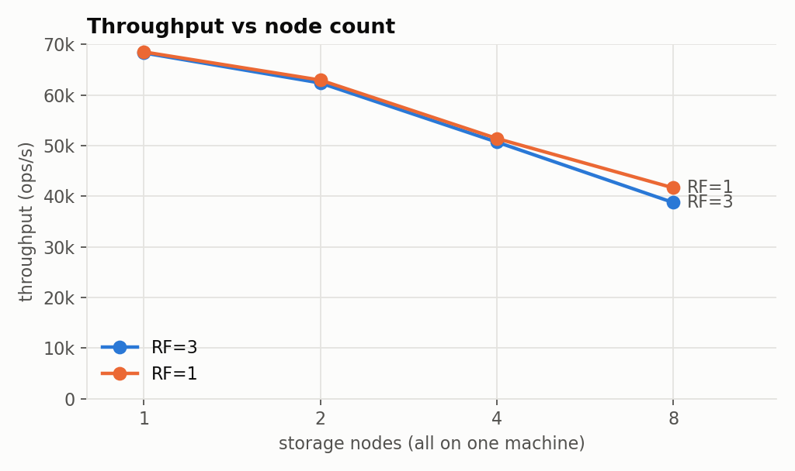
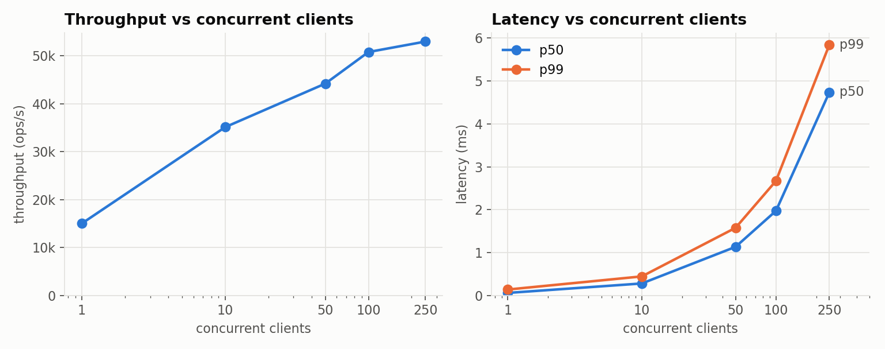
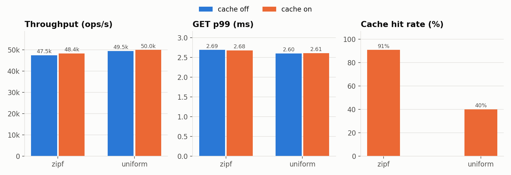
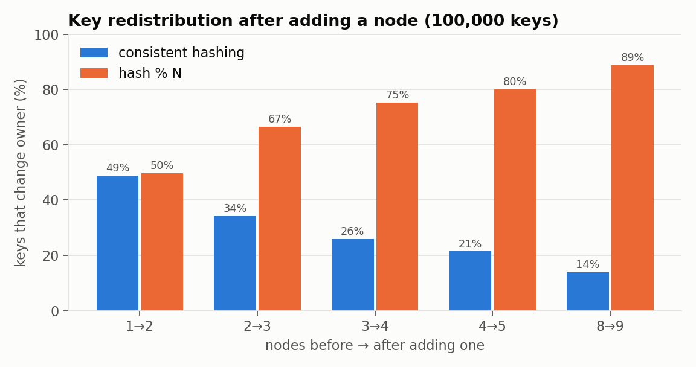
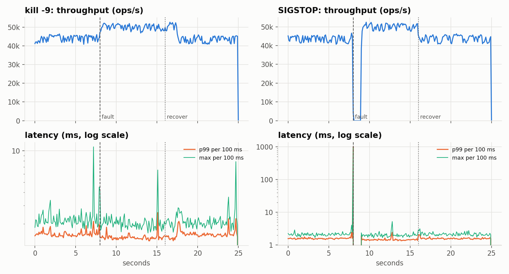
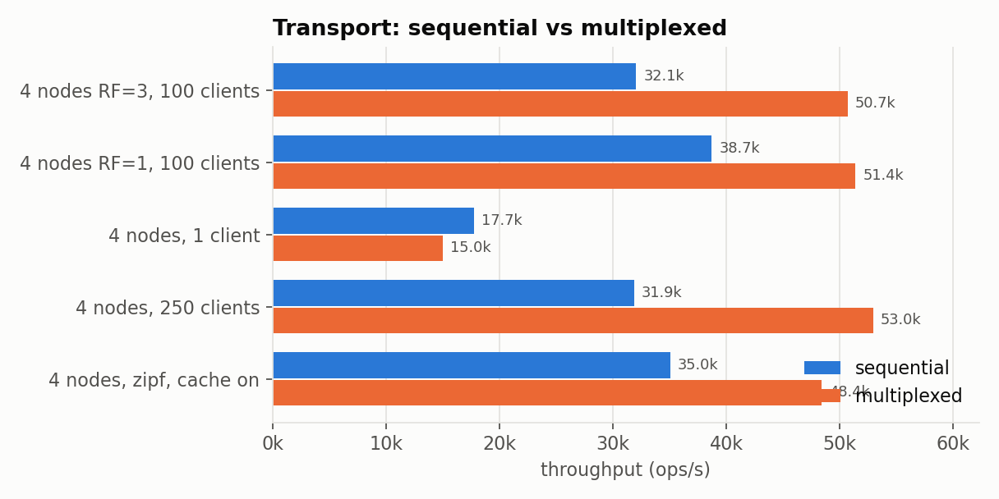

# Sharkey — Distributed Key-Value Store

A sharded, replicated, in-memory key-value store written from scratch in Go (standard library only). A coordinator routes requests over a **consistent-hash ring with virtual nodes**. **Storage nodes** keep their data in a sharded map behind a **thread-safe LRU cache**. Writes are **replicated with a quorum** (N=3, W=2). **Failure detection** drives replica fallback and resynchronisation of recovered nodes. Everything talks over a **length-prefixed binary TCP protocol with request multiplexing**, and a custom **load generator** produced every performance number in this file.

> **What this is not.** This is an interview- and learning-grade system, not DynamoDB or Cassandra. Data lives only in memory (no durability). There is no consensus and a single coordinator. There is no hinted handoff and no Merkle-tree anti-entropy. [Known limitations](#known-limitations) says exactly what is and isn't handled.

**Contents:** [Quick start](#quick-start) · [Architecture](#architecture) · [Request lifecycle](#request-lifecycle) · [Sharding & virtual nodes](#sharding-and-virtual-nodes) · [Caching](#caching) · [Replication & consistency](#replication-and-consistency) · [Failure handling](#failure-handling) · [Concurrency model](#concurrency-model) · [Network protocol](#network-protocol) · [Benchmark methodology](#benchmark-methodology) · [Benchmark results](#benchmark-results) · [Where the time goes](#where-the-time-goes) · [Tradeoffs](#tradeoffs) · [Known limitations](#known-limitations) · [How to run](#how-to-run) · [How to benchmark](#how-to-benchmark) · [Testing](#testing) · [Repository layout](#repository-layout)

---

## Quick start

```bash
make build            # bin/coordinator, bin/node, bin/client, bin/benchmark
make run-cluster      # coordinator :7100 + 4 nodes :7101-7104 (Ctrl-C stops)

# in another terminal
bin/client put user:42 '{"name":"Ada"}'
bin/client get user:42
bin/client locate user:42        # which nodes hold it (primary first)
curl -s localhost:8100/stats     # coordinator + per-node stats (JSON)
```

Or with Docker: `docker compose up --build` (same ports).

**Prerequisites:** Go 1.22+ on your `PATH` (no third-party Go modules). The scripts also need `bash`, `python3` and `nc`; `matplotlib` is optional (graphs only). On the development Mac, Homebrew refused to install Go because the Command Line Tools were outdated, so the official tarball was unpacked into `~/sdk/go`. If you do the same, run `export PATH="$HOME/sdk/go/bin:$PATH"` first.

> **Ports.** The coordinator listens on **7100**, not 7000: on macOS 12+ the AirPlay Receiver (ControlCenter) already owns port 7000 and would silently accept and hang our connections. Nodes use 7101–7104. Each process also serves HTTP on its port + 1000 (`/health`, `/stats`, `/debug/pprof/`).

---

## Architecture

```
                               CLIENTS  (bin/client, bin/benchmark, your code)
                                  |   framed binary protocol over TCP
                                  v
                    +---------------------------------+
                    |           COORDINATOR           |  :7100  (HTTP :8100)
                    |                                 |
                    |  consistent-hash ring           |  FNV-1a + fmix64, 128 vnodes/node
                    |  (sorted []point, binary search)|
                    |  replicator: N=3, W=2, R=1      |  versioned writes (monotonic clock)
                    |  node registry + health checker |  HEALTHY / UNHEALTHY / SYNCING
                    |  1 multiplexed TCP conn / node  |  request IDs, write coalescing
                    +----------------+----------------+
                                     |
            +------------------------+------------------------+
            |                        |                        |
            v                        v                        v
    +---------------+        +---------------+        +---------------+
    |    NODE A     |        |    NODE B     |        |    NODE C  ...|  :7101..  (HTTP :8101..)
    |  LRU cache    |        |  LRU cache    |        |  LRU cache    |  map + doubly linked list
    |  (10k entries)|        |               |        |               |
    |  sharded map  |        |  sharded map  |        |  sharded map  |  64 RWMutex shards,
    |  LWW versions |        |               |        |               |  last-writer-wins, tombstones
    +---------------+        +---------------+        +---------------+
            ^                        ^                        ^
            +------ coordinator fans each write out to the key's 3 replicas ------+
                    resync: SCAN pages from peers -> APPLY_BATCH to a recovered node
```

| Component | Package | Responsibility |
|---|---|---|
| Wire protocol | `internal/protocol` | frames, request/response codecs, size limits, scan pages |
| Transport | `internal/transport` | TCP server loop, sequential `Conn`, multiplexed `MuxConn`/`Pool`, write coalescing |
| Hash ring | `internal/consistenthash` | virtual nodes, owner lookup, distinct-physical-node replica sets |
| LRU cache | `internal/cache` | O(1) get/put/evict, hit/miss/eviction counters |
| Storage | `internal/storage` | `Engine` interface; sharded in-memory engine with LWW versions and tombstones |
| Storage node | `internal/node` | cache + storage + per-key lock striping, stats |
| Cluster | `internal/cluster` | node registry, state machine, health checker, boot-ID tracking |
| Replication | `internal/replication` | quorum writes, primary-first reads with fallback, read repair, resync |
| Coordinator | `internal/coordinator` | request routing, stats aggregation, runtime node addition |
| Metrics | `internal/metrics` | lock-free latency histogram, HTTP `/health` `/stats` `/debug/pprof` |
| Benchmark | `internal/bench`, `cmd/benchmark` | load generator (uniform/Zipf), fault injection, rebalance experiment |

## Request lifecycle

**`PUT k v`**
1. The client sends a `PUT` frame to the coordinator.
2. The coordinator computes `hash(k)`, binary-searches the ring for the first virtual node clockwise, and walks on to collect **3 distinct physical nodes**: the primary plus 2 replicas.
3. It stamps the write with a **version** from a monotonic hybrid clock (wall-clock ns, forced strictly increasing).
4. It sends the write to all 3 replicas **in parallel**, skipping nodes already known to be UNHEALTHY.
5. It replies OK once **W=2** replicas have acknowledged *and* the primary has answered (unless the primary is down; see [consistency](#replication-and-consistency)). Stragglers finish in the background.
6. Each node applies the write only if the version is newer than what it has (last-writer-wins). It then updates the cached value if one is present.

**`GET k`**
1. The coordinator computes the same replica set.
2. It asks the **primary**. If the primary is not HEALTHY, or the request fails or times out, it tries replica 1, then replica 2 ("replica fallback").
3. On the node: LRU hit → return. Miss → take the key's stripe lock, read storage, populate the cache, return.

**`DELETE k`** is a versioned write of a **tombstone**. That way a delayed older `PUT` can never resurrect the key, and a recovering node learns about deletes it missed.

## Sharding and virtual nodes

**Why consistent hashing?** With `hash(key) % N`, going from N to N+1 nodes changes the owner of about N/(N+1) of all keys, and every one of those keys must move. On a ring, a node owns only the arcs just counter-clockwise of its points. Adding a node therefore steals about 1/(N+1) of the keys, and only from its new neighbours. Test E measures this directly (e.g. 4→5 nodes: ~21% of keys move on the ring vs ~80% with modulo).

**Virtual nodes.** Each physical node is hashed onto the ring at 128 points (`"<addr>#<i>"`). With a single point per node, arc lengths vary wildly: the measured max node load was 1.44× the ideal at 4 nodes. With 128 points each node's share is a sum of 128 arcs and concentrates near 1/N, measured at 1.04× the ideal and a 2.9% standard deviation. Test E tabulates 1/8/32/128/256 vnodes.

**Hash function.** FNV-1a (64-bit), followed by MurmurHash3's `fmix64` finaliser. FNV-1a alone clusters short, similar inputs like `node-1#17` and `node-1#18`. The finaliser spreads every input bit across the output while staying deterministic.

**Implementation** (`internal/consistenthash/ring.go`): a sorted `[]point{hash, node}`; lookup is `sort.Search` (O(log V·N)) with wrap-around. `Replicas(key, n)` walks clockwise and **skips virtual nodes whose physical node is already chosen**, so a node can never count as two replicas. With fewer physical nodes than N, the effective replication factor is the node count (a 2-node cluster has RF 2). The ring is guarded by an `RWMutex`: lookups share it, membership changes take it exclusively.

**Adding a node at runtime.** `POST http://localhost:8100/nodes?addr=host:port` adds the node to the ring in `SYNCING` state. It receives writes immediately. Resync then copies it every entry it now replicates, and only after that does it serve reads. `TestAddNodeAtRuntime` checks that primaries moved only to the new node (≈20%) and that every key stayed readable throughout.

## Caching

`internal/cache/lru.go` is written from scratch: a `map[string]*entry` plus a circular doubly linked list with a sentinel.

| op | how | cost |
|---|---|---|
| Get | map lookup, move element to front | O(1) |
| Put | update-and-move, or insert at front | O(1) |
| Evict | unlink the element before the sentinel (LRU end) | O(1) |

- **Thread safety:** one `sync.Mutex` per cache. A `RWMutex` would buy nothing, because every `Get` mutates the list (move-to-front). Counters are atomics, so `/stats` never takes the lock for them.
- **Read path:** cache → storage → populate. **Write path:** `PUT` *updates* the entry if it is cached but doesn't allocate one; `DELETE` invalidates. Not allocating on write keeps the two non-primary replicas, which take every write but serve reads only on fallback, from filling their caches with keys nobody reads from them.
- **Coherence under concurrency:** there is a subtle race: a GET misses and reads v1, a PUT writes v2, and then the GET populates the cache with v1, which is stale forever. Nodes prevent it with **256 striped key locks**. The miss path (read storage + populate) and the write path (apply + update cache) for a key hold the same stripe, so they serialise; cache hits take no stripe lock. `TestCacheNeverStaleUnderConcurrency` hammers this.
- Default capacity is 10,000 entries per node (`--cache-capacity`, 0 disables). Hits, misses, evictions and hit rate appear in node `/stats` and are summed in coordinator `/stats`.

## Replication and consistency

**Placement.** N=3 by default: the primary plus the next 2 distinct physical nodes clockwise.

**Write policy.** Writes are synchronous and quorum-based, with W=2 by default (`--write-quorum`). The coordinator waits for W acks **including the primary's answer when the primary is up**. Why the primary? Reads go to the primary. If two non-primary replicas could form the quorum, a client could write, get an ack, and immediately read the old value from the primary. The first version of this code did exactly that, and `TestConcurrentClients` caught it: read-your-writes failures under load. With the primary in the quorum, read-your-writes holds whenever the primary is healthy.

**Ordering.** Every write carries a version from the coordinator's monotonic clock. Nodes apply last-writer-wins by version, so replicas converge to the same value no matter the order in which messages, retries or resync copies arrive. Replayed writes are idempotent, which is also what makes the transport's retry-once-on-dead-connection safe.

**Read policy.** R=1 by default: read the primary and fall back down the preference list. Optionally `--read-quorum 2`: ask all healthy replicas, wait for 2, return the highest version, and **read-repair** stale replicas in the background (`TestReadQuorumRepairsStaleReplica`).

**What you actually get — be precise:**

| Property | Status |
|---|---|
| Replication | ✅ each key on N distinct nodes; writes fan out in parallel |
| Availability | ✅ reads survive N−1 replica failures; writes survive N−W (1 of 3) |
| Read-your-writes | ✅ while the key's primary is HEALTHY (it is in every write quorum). Not guaranteed while the primary is SYNCING: it accepts writes but reads skip to replica 1, which may not have been in that write's ack pair |
| Stale reads | ⚠️ possible with R=1 after a primary failure: the fallback replica may be the one that missed the latest write. `R=2, W=2` (R+W>N) closes that gap for acknowledged writes |
| Linearizability | ❌ not provided. No consensus, and no ordering of concurrent in-flight operations; concurrent writers to one key resolve by version (clock order), not by any agreed log |
| Failed writes | ⚠️ not rolled back. A write that fails its quorum may still exist on 1 replica and become visible later (standard for Dynamo-style quorums) |
| Durability | ❌ none. Storage is in memory; a node restart loses its data and relies on resync from peers. Losing all 3 replicas of a key loses the key |
| Multiple coordinators | ❌ unsupported. Versions from different clocks would be ordered only as well as clocks are synchronised |

## Failure handling

**Detection (a local opinion, not consensus).** The coordinator pings every node every 2 s (`--health-interval`) with a 500 ms timeout. Failed pings **and transport errors on real requests** (refused connections, resets, timeouts) both count toward `--failure-threshold` (3 consecutive). Counting real requests is why a crash under load is detected in tens of milliseconds rather than seconds. Application-level errors don't count. When a node becomes UNHEALTHY, its connection is closed, which instantly fails requests stuck on it.

**Node states.**
```
HEALTHY --3 consecutive failures--> UNHEALTHY --health check succeeds--> SYNCING --resync done--> HEALTHY
HEALTHY --health check shows a new boot ID (fast restart)-------------> SYNCING
```
- **UNHEALTHY** nodes get no traffic. Writes skip them (and are counted), and reads fall back.
- **SYNCING** nodes get writes but not reads, because they may be missing data.
- **Boot IDs.** Each node process generates a random boot ID at start, and health checks return it. A changed boot ID means the node restarted and lost its in-memory data, even if the restart was too fast for any health check to fail. `TestFastRestartDetectedByBootID` covers this.

**Resync (anti-entropy on rejoin).** For a SYNCING node, the coordinator pages through every other healthy node's data (`SCAN`, 256 KB pages). It filters the entries whose replica set includes the target and sends each page's worth in one `APPLY_BATCH` request. Tombstones are included, so deletes the node missed are applied. Last-writer-wins makes this safe to run concurrently with live writes: an old copied value can never overwrite a newer live write. Batching sends one RPC per 256 KB page instead of one per key; in the saved validation run (`benchmarks/results/validation/`) a restarted node was resynced with 30,186 entries in tens of milliseconds.

**Timeouts everywhere.** There are dial timeouts (500 ms), per-replica request timeouts (1 s), health-check timeouts, client request timeouts, server idle and write deadlines, and a benchmark request timeout. Nothing waits indefinitely on a dead node.

**What's handled:** crash (kill -9), hang (SIGSTOP), fast restart, restart with data loss, adding a node, a single replica down during writes, and a primary down during reads.

**What's not:**
- Network partitions where the coordinator's view differs from reality (it can't tell a slow node from a dead one).
- Losing 2 of a key's 3 replicas: writes fail their quorum, and reads still work from the survivor.
- Losing all replicas of a key: the data is gone.
- Coordinator failure: it is a single point of failure.
- Hinted handoff and sloppy quorums: writes to a down replica are not parked elsewhere; resync covers it later.
- Removing a node from the ring at runtime.
- Tombstone garbage collection.

## Concurrency model

- **One goroutine per connection** reads frames. Coordinator requests run in **their own goroutines**, so a slow request never blocks the next one on the same multiplexed connection. A per-connection semaphore (256 in flight) provides backpressure through TCP flow control. Storage-node handlers never block on I/O, so a node runs a request **inline** on the reader goroutine when nothing else is in flight on that connection.
- **Locks are narrow, never global:**

| shared structure | synchronisation |
|---|---|
| KV map | 64 shards, each with its own `sync.RWMutex` |
| cache + storage coherence | 256 striped `sync.Mutex` key locks (miss path and write path only) |
| LRU cache | one `sync.Mutex` (every access mutates recency) |
| hash ring | `sync.RWMutex` (lookups shared, membership changes exclusive) |
| node registry | `RWMutex` for the member map + one `Mutex` per member's state |
| counters, histograms, version clock | `sync/atomic` (clock via CAS loop) |
| multiplexed connection | `Mutex` for the pending-request map; `frameWriter` mutex for the send buffer |

- `go test -race ./...` passes (see [Testing](#testing)).

## Network protocol

Every message is a frame: a `u32` big-endian length followed by the payload. **There is no newline parsing.** Keys and values may contain any bytes, including `\n` and `\0`, which the tests cover.

```
request  payload: | id u32 | op u8 | flags u8 | version u64 | keyLen u32 | key | valLen u32 | value |
response payload: | id u32 | status u8 | version u64 | valLen u32 | value |
ops:      GET PUT DELETE PING STATS | node-internal: SCAN APPLY_BATCH | coordinator: LOCATE
statuses: OK NOT_FOUND ERROR BAD_REQUEST UNAVAILABLE
flags:    REPLICA (counts as replication op), SYNC (resync/read-repair)
```

- **Limits:** keys up to 1 KiB, values up to 1 MiB, frames up to 4 MiB, all configurable. An oversized frame is rejected from its length header before any allocation. The server replies `BAD_REQUEST` and closes the connection, because the stream can't be resynchronised. A well-framed but malformed payload (truncated fields, trailing bytes, unknown op) gets `BAD_REQUEST`, and **the connection stays usable**.
- **Multiplexing:** the request `id` is echoed back, so one connection carries many concurrent requests and responses may return out of order. The coordinator keeps **one multiplexed connection per storage node**. A caller whose context expires removes its pending entry, so a late response is dropped rather than delivered to the wrong caller. A broken connection fails all its pending requests at once. The pool retries once on a fresh connection, which is safe because every operation is idempotent.
- **Write coalescing:** there is no writer goroutine. The goroutine that finds no flush in progress writes everything queued so far in one syscall. Under load (≥8 requests in flight on the connection) it first lingers up to 100 µs to let more frames join. `/stats` reports `write_coalescing.frames_per_write`.
- **Connection hygiene:** the server applies an idle timeout, per-response write deadlines, a max connection count and graceful shutdown (stop accepting, let in-flight requests finish, then close).

---

## Benchmark methodology

- **Tool:** `cmd/benchmark` (`internal/bench`), written for this project. Each simulated client owns **one TCP connection with one outstanding request**, like an independent user. Clients pick GET vs PUT by `--read-ratio` and keys from a uniform or **Zipfian** distribution. The Zipfian generator is Gray et al.'s, the same one YCSB uses, with θ=0.99 so hot keys exist.
- **Measured, never assumed:** every request's latency is recorded, and **p50/p95/p99/p99.9/max are exact nearest-rank percentiles over all samples** (not a histogram estimate). Throughput counts successful operations over the measured wall-clock time. Cache hits and misses are the **delta** of cluster-wide counters read from the coordinator before and after the measured phase.
- **Protocol:** every key is preloaded first, so GETs hit real data. Then 3 s of warm-up (unmeasured) and 15 s measured, **3 repeats** per configuration with different seeds. Tables show the median, with the min–max range for throughput. Failure tests add a 100 ms timeline, a 5 ms probe of one watched key, and fault commands the benchmark itself executes on its own clock.
- **Environment (important):** the coordinator, every storage node and the load generator run on **one machine** (Apple M5 Pro, 15 cores, macOS, Go 1.27) over **loopback TCP**. They share CPUs and one kernel network stack. Absolute numbers would differ on separate machines. Relative comparisons (cache on/off, transport before/after, concurrency) are the meaningful results.
- **Integrity:** raw JSON for every run is in `benchmarks/results/<transport>/<suite>/`. `scripts/summarize.py` turns it into `benchmarks/SUMMARY.md`, the graphs, **and the tables below** (between the `GENERATED RESULTS` markers). No number in this section was typed by hand.

## Benchmark results

All tables between the markers below are generated from raw JSON by `scripts/summarize.py`. The interpretation that follows reads them; where it quotes a number, that number appears in the tables.








**Reading the results honestly:**

- **Scaling (Test A): more nodes are *slower* on one machine, and the data shows why.** Throughput drops from ~68k ops/s (1 node) to ~51k (4) to ~39k (8), and RF=1 follows almost the same curve, so replication isn't the cause. Two effects, both measured:
  1. Every node is another process competing for the same 15 cores.
  2. The same load spread over more connections batches less. The *frames per write syscall* column falls on the node side from ~9.2 (1 node) to ~1.0 (8 nodes).

  On separate machines, each node would bring its own CPU and NIC, and this curve would not transfer. **This test demonstrates correct sharding at 1/2/4/8 nodes. It does not demonstrate horizontal scalability.** A multi-machine run is the missing experiment. One side effect is real, though: aggregate cache capacity grows with node count (uniform-key hit rate rises from ~10% at 1 node to ~83% at 8).
- **Cache (Test B): high hit rate, negligible speed-up.** With Zipf θ=0.99 and 10k entries/node, 90.9% of GETs hit the LRU, yet throughput and GET p99 change by only ~2% and ~0%. That's expected here. A cache hit replaces one in-memory map lookup with another map lookup plus a list splice, both nanoseconds, while every request pays two loopback round trips measured in tens of microseconds ([where the time goes](#where-the-time-goes)). An LRU earns its keep in front of a slow engine (disk, remote store). The implementation, eviction order and hit-rate accounting are what this test validates. The storage engine was *not* slowed down to manufacture a better number.
- **Concurrency (Test C):** throughput climbs from ~15k ops/s (1 client, p50 ~60 µs) to ~53k (250 clients). Past ~100 clients the system is saturated, so extra clients mostly add queueing latency: p99 goes ~2.7 ms → ~5.8 ms (Little's law: latency ≈ clients ÷ throughput).
- **Failure (Test D):**
  - **kill -9:** 0 client errors. The failure was detected in ~15 ms (passive detection: requests to the dead node get *connection refused* immediately, and three of those mark it down), and the worst probe GET of the dead primary's key took ~3 ms. Throughput actually *rises* while the node is down, because one fewer process competes for the CPU.
  - **SIGSTOP (hang):** also 0 errors, but requests that touch the frozen node (reads where it is primary, and writes, which wait for the primary's answer) stall until the **1 s request timeout**. Three such timeouts mark it UNHEALTHY at ~1.0 s, its connection is closed, and everything after that falls back instantly. The ~1 s throughput dip in the graph is the price of the timeout value. Lowering `--request-timeout` shortens the dip but raises the risk of falsely suspecting a slow node.
  - **Recovery:** the resumed or restarted node is detected by the next health check (≤2 s interval), resynced, and HEALTHY again: ~0.3 s after SIGCONT and ~1.9 s after a restart (which also waits for process start and a health-check tick).
- **Rebalancing (Test E):** adding a 5th node moves 21.5% of keys under consistent hashing vs 80.0% under `hash % N` (theory: 20% vs 80%). Only keys belonging to the added or removed node ever move. 128 vnodes keep the most-loaded of 4 nodes within ~4% of ideal (1 vnode: 44% over).
- **Transport (before/after):** switching node connections from one-request-per-round-trip to multiplexed connections with write coalescing gave **1.58× throughput** at 4 nodes/100 clients and **1.66×** at 250 clients, with lower p99. **The cost is single-client latency.** At 1 client (nothing to batch) the multiplexed path is 0.85× the throughput (p50 ~60 µs vs ~49 µs) because each node response now crosses a reader goroutine before reaching the caller. That trade was kept deliberately: the system is meant to serve many concurrent clients.

**Benchmark hygiene note.** The first run of Test A executed repeats back to back. Some 4- and 8-node runs came out 40% lower than the identical configuration in Test C, with unstable timelines, and re-running in isolation reproduced the higher number. The laptop was shared with other foreground work. The suite now interleaves repeats and records the machine's load average in every result. The superseded files are kept in `benchmarks/results/discarded/` with an explanation, and nothing above uses them.

<!-- BEGIN GENERATED RESULTS -->
Generated by `scripts/summarize.py` from the raw JSON in `benchmarks/results/mux/`. Machine: darwin/arm64, 15 CPUs, go1.27.1. The coordinator, all storage nodes and the load generator run on this one machine over loopback TCP, so they compete for the same CPUs.

#### Test A — scaling with node count

100 clients, 80% GET, uniform keys over 100,000, 100 B values, 15 s per run after 3 s warm-up.

| config | ops/s median (range) | p50 | p95 | p99 | max | errors | frames per write syscall (coordinator / nodes) | runs |
|:---|---:|---:|---:|---:|---:|---:|---:|---:|
| 1 node, RF=3 (effective 1) | 68,287 (68,189-68,536) | 1.46 ms | 1.83 ms | 2.03 ms | 4.56 ms | 0 | 1.75 / 9.18 | 3 |
| 2 nodes, RF=3 (effective 2) | 62,358 (62,279-62,523) | 1.60 ms | 1.98 ms | 2.19 ms | 7.02 ms | 0 | 1.75 / 4.11 | 3 |
| 4 nodes, RF=3 (effective 3) | 50,695 (50,265-50,968) | 1.98 ms | 2.40 ms | 2.62 ms | 9.30 ms | 0 | 1.66 / 1.70 | 3 |
| 8 nodes, RF=3 (effective 3) | 38,754 (38,617-38,862) | 2.59 ms | 2.98 ms | 3.20 ms | 10.58 ms | 0 | 1.29 / 1.05 | 3 |
| 1 node, RF=1 (effective 1) | 68,488 (68,447-68,596) | 1.45 ms | 1.82 ms | 2.03 ms | 5.44 ms | 0 | 1.75 / 9.20 | 3 |
| 2 nodes, RF=1 (effective 1) | 62,929 (62,489-62,997) | 1.59 ms | 1.96 ms | 2.17 ms | 3.72 ms | 0 | 1.62 / 3.21 | 3 |
| 4 nodes, RF=1 (effective 1) | 51,403 (51,333-51,728) | 1.95 ms | 2.28 ms | 2.46 ms | 5.32 ms | 0 | 1.42 / 1.27 | 3 |
| 8 nodes, RF=1 (effective 1) | 41,651 (41,582-41,864) | 2.41 ms | 2.68 ms | 2.84 ms | 6.41 ms | 0 | 1.10 / 1.01 | 3 |

#### Test B — cache disabled vs enabled

4 nodes, 100 clients, 90% GET, 100,000 keys, Zipf θ=0.99 (hot keys) and uniform. Latency columns are GET latency measured by the client.

| config | ops/s median (range) | GET p50 | GET p95 | GET p99 | cache hit rate | runs |
|:---|---:|---:|---:|---:|---:|---:|
| zipf, cache off | 47,534 (47,476-48,099) | 2.10 ms | 2.49 ms | 2.69 ms | — | 3 |
| zipf, cache 10,000 entries/node | 48,411 (48,242-48,895) | 2.07 ms | 2.46 ms | 2.68 ms | 90.9% | 3 |
| uniform, cache off | 49,539 (49,471-50,233) | 2.02 ms | 2.40 ms | 2.60 ms | — | 3 |
| uniform, cache 10,000 entries/node | 50,031 (49,719-50,146) | 2.00 ms | 2.39 ms | 2.61 ms | 40.0% | 3 |

#### Test C — concurrency

4 nodes (RF=3, W=2), 80% GET, uniform keys over 100,000.

| clients | ops/s median (range) | p50 | p95 | p99 | max | errors | runs |
|:---|---:|---:|---:|---:|---:|---:|---:|
| 1 client | 15,027 (13,979-15,470) | 60 µs | 104 µs | 138 µs | 1.22 ms | 0 | 3 |
| 10 clients | 35,123 (34,972-35,142) | 280 µs | 380 µs | 445 µs | 2.40 ms | 0 | 3 |
| 50 clients | 44,209 (44,025-44,526) | 1.13 ms | 1.41 ms | 1.58 ms | 6.69 ms | 0 | 3 |
| 100 clients | 50,798 (50,306-52,057) | 1.97 ms | 2.41 ms | 2.67 ms | 10.15 ms | 0 | 3 |
| 250 clients | 52,983 (52,485-54,008) | 4.73 ms | 5.45 ms | 5.84 ms | 18.61 ms | 0 | 3 |

#### Test D — primary failure under load

4 nodes, 50 clients, 80% GET, 25 s run. At t=8 s the primary of `bench-00000042` is killed (`kill -9`) or frozen (`kill -STOP`); at t=16 s it is restarted / resumed. A separate probe GETs that key every 5 ms. Medians over runs.

| fault | total ops | client errors after fault | baseline p99 | peak 100ms-p99 | slowest op | detected after | probe errors | probe worst | fallback settled | recovered→all healthy | runs |
|:---|---:|---:|---:|---:|---:|---:|---:|---:|---:|---:|---:|
| kill -9 (crash) | 1,160,813 | 0 | 1.57 ms | 2.56 ms | 6.18 ms | 15 ms | 0 | 3.11 ms | 0 ms | 1,877 ms | 3 |
| SIGSTOP (hang) | 1,098,324 | 0 | 1.60 ms | 1002.33 ms | 1002.33 ms | 1,016 ms | 0 | 1000.67 ms | 1,003 ms | 315 ms | 3 |

*detected after*: fault → coordinator reports fewer healthy nodes. *fallback settled*: fault → end of the last probe slower than 10× its pre-fault median (0 = none). *recovered→all healthy*: restart/resume → node back to HEALTHY after resync.

#### Test E — key redistribution (100,000 keys, 128 vnodes/node)

| membership change | consistent hashing: keys moved | modulo: keys moved | theoretical minimum | only keys of added/removed nodes moved |
|:---|---:|---:|---:|---:|
| 1 → 2 | 48.84% | 49.71% | 50.00% | yes |
| 2 → 3 | 34.19% | 66.60% | 33.33% | yes |
| 3 → 4 | 26.02% | 75.28% | 25.00% | yes |
| 4 → 5 | 21.46% | 80.02% | 20.00% | yes |
| 8 → 9 | 13.90% | 88.77% | 11.11% | yes |
| 5 → 4 | 21.46% | 80.02% | 20.00% | yes |
| 8 → 7 | 13.39% | 87.50% | 12.50% | yes |

Load balance across 4 nodes vs virtual-node count:

| vnodes/node | min keys | max keys | max ÷ ideal | std-dev of load |
|:---|---:|---:|---:|---:|
| 1 | 10,881 | 35,952 | 1.438 | 37.3% |
| 8 | 14,328 | 37,272 | 1.491 | 33.1% |
| 32 | 23,243 | 26,760 | 1.070 | 6.0% |
| 128 | 24,024 | 26,019 | 1.041 | 2.9% |
| 256 | 24,714 | 25,514 | 1.021 | 1.2% |

#### Transport optimisation — before/after

Same configurations, same machine. *sequential*: one request per connection round trip, pooled connections per node (up to 256 kept idle). *mux*: request IDs, one multiplexed connection per node, write coalescing with adaptive linger, inline handling on nodes. Both runs use the same benchmark client (one sequential connection per simulated client).

| configuration | sequential ops/s | multiplexed ops/s | speed-up | sequential p99 | multiplexed p99 |
|:---|---:|---:|---:|---:|---:|
| 4 nodes RF=3, 100 clients | 32,053 | 50,695 | 1.58× | 3.67 ms | 2.62 ms |
| 4 nodes RF=1, 100 clients | 38,708 | 51,403 | 1.33× | 3.11 ms | 2.46 ms |
| 4 nodes, 1 client | 17,746 | 15,027 | 0.85× | 121 µs | 138 µs |
| 4 nodes, 250 clients | 31,870 | 52,983 | 1.66× | 8.68 ms | 5.84 ms |
| 4 nodes, zipf, cache on | 35,038 | 48,411 | 1.38× | 3.38 ms | 2.69 ms |

#### Coordinator CPU profile under load

4 nodes, 100 clients, 10 s CPU profile of the coordinator (`scripts/profile.sh`; raw `.pprof` and `-top` output in `benchmarks/results/<transport>/profile/`).

| transport | ops/s during profile | coordinator cores busy | cores in syscalls | share in syscalls | coordinator CPU per op | syscall CPU per op |
|:---|---:|---:|---:|---:|---:|---:|
| sequential | 32,048 | 4.53 | 3.39 | 75% | 141 µs | 106 µs |
| mux | 50,985 | 5.15 | 2.99 | 58% | 101 µs | 59 µs |

<!-- END GENERATED RESULTS -->

## Where the time goes

The system is **syscall-bound**, not compute-bound, as the profiles show (`scripts/profile.sh`, CPU profile of the coordinator under 100-client load):

- On the original sequential transport, **75% of coordinator CPU was inside `read`/`write` syscalls**. Each client operation costs the coordinator one read and one write on the client side, plus a write and a read per storage-node RPC (three RPCs for a PUT). On macOS loopback each syscall costs roughly 10–20 µs of CPU. User-space work (hashing, ring lookup, map access, LRU) doesn't show up among the top functions at all.
- The experiments that led to the final transport. These were single 5-second development runs, used to choose the design; they are *not* part of the saved result set, which is why they are stated loosely:
  1. `--replication 1` raised throughput only in proportion to the syscalls it removed, which confirmed the model.
  2. Multiplexing alone changed nothing. The new `write_coalescing` counter read exactly 1.00 frames per write: at ~2.5k frames/s per connection, writes never overlapped.
  3. One connection per node (instead of four) concentrated the frames and gave +15%.
  4. An adaptive **linger** (wait up to 100 µs for more frames, but only when ≥ 8 requests are in flight on that connection) raised node-side batching to ~2–9 frames per syscall. The threshold keeps lightly loaded connections from paying the delay.
  5. Running node handlers inline when a connection is idle removed a goroutine handoff.
- Net effect (table *Coordinator CPU profile under load* above): **syscall CPU per operation fell from ~106 µs to ~59 µs**, and coordinator CPU per operation from ~141 µs to ~101 µs.

Further headroom would come from the same place: batching on the client-to-coordinator leg (clients that pipeline requests), or `writev`/`io_uring`-style APIs on Linux. Not from micro-optimising the data structures.

## Tradeoffs

| Decision | Why | Cost |
|---|---|---|
| Coordinator-based routing (vs client-side ring or gossip) | One place owns the ring, health view and version clock; clients stay trivial | Extra network hop per request; single point of failure; the coordinator is the throughput bottleneck on one box |
| Coordinator fans out writes (vs primary→replica chain) | One hop on the critical path; a slow primary can't delay replicas | Coordinator does N sends per write |
| Primary must be in the write quorum when it is up | Read-your-writes for primary reads, with no read quorum needed | A hung primary stalls writes for up to the request timeout (Test D, SIGSTOP) |
| W=2, R=1 by default | Fast reads, tolerates 1 replica down for writes | R+W ≤ N: stale reads possible after a primary failure; `--read-quorum 2` fixes that at 2× read cost |
| Last-writer-wins by coordinator clock | Simple, convergent, idempotent retries/resync | Concurrent writes silently resolve by timestamp; no conflict detection (vector clocks) |
| Tombstones for deletes | Deletes can't be undone by late/replayed writes or resync | Tombstones are never garbage-collected |
| Full-scan resync with batched apply | Simple and obviously correct (LWW); ~30k entries in tens of ms | Cost ∝ total data; Merkle trees would ship only differences |
| LRU without write-allocate | Replicas don't fill caches with write-only keys | First read after a write is a miss |
| One mutex per LRU | Simple; every access mutates recency anyway | Contention at very high hit rates; sharded LRU or CLOCK would scale further |
| Multiplexed connection + linger | ~1.6× throughput under load (measured) | Single-client latency +~10 µs; a hung node stalls every request on its connection until timeout |
| Passive failure detection from request errors | Crash detected in ~15 ms instead of up to 3 health intervals | A briefly overloaded node can be falsely marked down |
| In-memory storage | Focus on distribution, not storage engines | No durability |

## Known limitations

- **No durability.** Memory only. The `storage.Engine` interface is the seam for a WAL + snapshot or LSM engine; none exists yet.
- **No consensus and a single coordinator.** The coordinator is a single point of failure, and its failure detector is a local, timeout-based opinion. Membership changes are not agreed by any quorum.
- **Not linearizable.** Quorum replication with last-writer-wins by coordinator clock. Stale reads are possible under R=1 after a primary failure, and a failed-quorum write is not rolled back.
- **Anti-entropy is a full scan.** Resync reads all peers' data; Merkle trees per key range would transfer only differences. There is also no hinted handoff.
- **Membership:** nodes can be added at runtime but not removed. Tombstones are never garbage-collected.
- **Single-machine benchmarks.** All numbers come from one laptop over loopback. See [methodology](#benchmark-methodology).
- **Security:** no authentication, authorisation or TLS.
- Compared with production systems like DynamoDB and Cassandra, this is missing: durable commit logs, gossip-based membership, hinted handoff, Merkle-tree repair, vector clocks or other conflict detection, tunable per-request consistency, multi-datacenter replication, compaction, and operational tooling.

---

## How to run

**Locally (no Docker):**
```bash
make build
make run-cluster                      # 4 nodes + coordinator, logs in .run/logs/
# or by hand:
bin/node --port 7101 &                # repeat for 7102..7104
bin/coordinator --port 7100 --nodes localhost:7101,localhost:7102,localhost:7103,localhost:7104
```

**Docker:** `docker compose up --build` starts `node1..node4` and the coordinator with the same host ports (7100–7104, HTTP 8100–8104). Verified with colima (docker 29): CRUD from the host, `docker compose kill node2` → reads keep working → `docker compose start node2` → boot-ID change detected → resync → healthy. Inside compose the coordinator knows nodes as `node1:7101` etc., so host-side tools that follow `locate` to the nodes (`verify-replication`) only work with the non-Docker cluster.

**Client CLI:**
```bash
bin/client put k v | get k | delete k | locate k | stats | health
bin/client --addr localhost:7102 get k       # read directly from one storage node
bin/client bulk-put --count 10000            # plus bulk-get / bulk-delete / verify-replication
make validate                                # the full end-to-end validation script
```

**Configuration.** All flags have defaults; run with `-h` to list them.

| flag (coordinator) | default | | flag (node) | default |
|---|---|---|---|---|
| `--port` | 7100 | | `--port` | 7101 |
| `--nodes` | localhost:7101..7104 | | `--cache-capacity` | 10000 (0 = off) |
| `--vnodes` | 128 | | `--idle-timeout` | 2m |
| `--replication` / `--write-quorum` / `--read-quorum` | 3 / 2 / 1 | | `--max-conns` | 4096 |
| `--health-interval` / `--health-timeout` | 2s / 500ms | | `--max-key-size` / `--max-value-size` | 1 KiB / 1 MiB |
| `--failure-threshold` | 3 | | `--http-port` | port+1000 |
| `--dial-timeout` / `--request-timeout` | 500ms / 1s | | | |
| `--conns-per-node` | 1 | | | |

## How to benchmark

```bash
make benchmark                 # one 10 s run against a fresh 4-node cluster
make benchmark-scaling         # TEST A  1/2/4/8 nodes, RF=3 and RF=1
make benchmark-cache           # TEST B  cache off/on, Zipf and uniform
make benchmark-concurrency     # TEST C  1/10/50/100/250 clients
make benchmark-failure         # TEST D  kill -9 and SIGSTOP the primary of a key
make benchmark-rebalance       # TEST E  key movement: ring vs modulo, vnode balance
make benchmark-all             # all of the above (~25 min) + summarize
make summarize                 # regenerate SUMMARY.md, graphs and README tables

# ad hoc
bin/benchmark --address localhost:7100 --clients 100 --requests 1000000 \
  --read-ratio 0.8 --keyspace 100000 --distribution zipf --out result.json
```

Env overrides for the scripts: `DURATION`, `WARMUP`, `REPEATS`, `KEYSPACE`, `VALUE_SIZE`, `CLIENTS`. Results land in `benchmarks/results/$TRANSPORT_TAG/` (default `mux`). The pre-optimisation baseline lives in `benchmarks/results/sequential/`.

## Testing

```bash
make test      # go test ./...
make race      # go test -race ./...
make check     # gofmt check + go vet + race tests
```

Test inventory (unit tests per package plus integration tests over real TCP in `tests/`):

| Area | Tests |
|---|---|
| Protocol | request/response round trips (binary values with `\n`, `\0`), every truncated prefix rejected, bogus lengths, trailing bytes, frame limits, scan pages |
| Transport | concurrent round trips, malformed payload keeps connection usable, oversized frame closes it, oversized value rejected, request timeout vs a hung server, dial refused, idle timeout, retry after server restart, graceful shutdown waits for in-flight, connection limit, **mux: 200 out-of-order responses on one connection, timeout doesn't poison the connection, connection loss fails all pending**, inline mode under load |
| Hash ring | empty/single node, deterministic routing, vnode balance, **add node moves ~1/(N+1) and only to the new node (vs modulo)**, remove node moves only its keys, replicas distinct and ordered, RF capped at node count, replica sets stable under unrelated changes, concurrent lookups vs membership changes |
| LRU | get/put, eviction order, update refreshes recency, delete + list integrity, hit-rate stats, capacity 1, concurrent access |
| Storage | LWW ordering, idempotent replays, tombstones block resurrection, paginated scan visits every key once (incl. 1-entry pages across shard boundaries), concurrent counts stay consistent |
| Node | CRUD with/without cache, read-through + invalidation, no write-allocate, stale replicated write ignored, **cache never stale under concurrent GET/PUT/DELETE**, batch apply, scan over TCP |
| Cluster | state machine thresholds, request success can't revive a node, boot-ID change triggers resync, superseded resync ignored, health checker detects crash, restart and hang (timeout) |
| Integration (`tests/`) | CRUD, limits end-to-end, malformed messages to the coordinator, replica placement on exactly the 3 owners + delete propagation, 1/2/4/8-node clusters, **primary crash fallback before and after detection**, **hung node: timeout then fast path**, write quorum not met, **restart → resync restores latest values and deletes**, **fast restart detected by boot ID**, **read quorum repairs a stale replica**, **add node at runtime**, 32 concurrent clients + hot-key convergence, stats and locate |
| Benchmark | Zipf skew, exact percentiles, rebalance invariants, a full run against an in-process cluster |

`make validate` (`scripts/validate.sh`) runs the end-to-end scenario against real processes: PUT 10,000 keys → verify GETs → verify every key on all 3 replicas by reading the nodes directly → DELETE half and verify on every replica → `kill -9` a node → verify all reads immediately → write 10,000 more with the node down → restart it → wait for resync → verify the restarted node holds every key it should, including the writes and deletes it missed. Saved logs: `benchmarks/results/validation/`.

## Repository layout

```
cmd/
  coordinator/   node/   client/   benchmark/
internal/
  protocol/        wire format, limits, scan pages
  transport/       server loop, Conn, MuxConn, Pool, frameWriter (coalescing)
  consistenthash/  ring + virtual nodes
  cache/           LRU
  storage/         Engine interface + sharded in-memory engine
  node/            storage node service
  cluster/         registry, state machine, health checker
  replication/     quorum writes, fallback reads, read repair, resync
  coordinator/     routing, stats, runtime node add
  clock/           monotonic version clock
  metrics/         histogram + HTTP admin (/health /stats /debug/pprof)
  bench/           load generator, Zipf, fault injection, rebalance experiment
  client/          Go client library
  testcluster/     in-process cluster harness for tests
  cmdutil/         shared flag/signal helpers
tests/             end-to-end integration tests (real TCP)
scripts/           cluster launch, benchmark suites A-E, validation, summarize.py
benchmarks/
  results/         raw JSON per run (sequential = before, mux = after) + validation logs
  graphs/          PNGs generated by summarize.py
  SUMMARY.md       generated tables
Dockerfile  docker-compose.yml  Makefile
```
